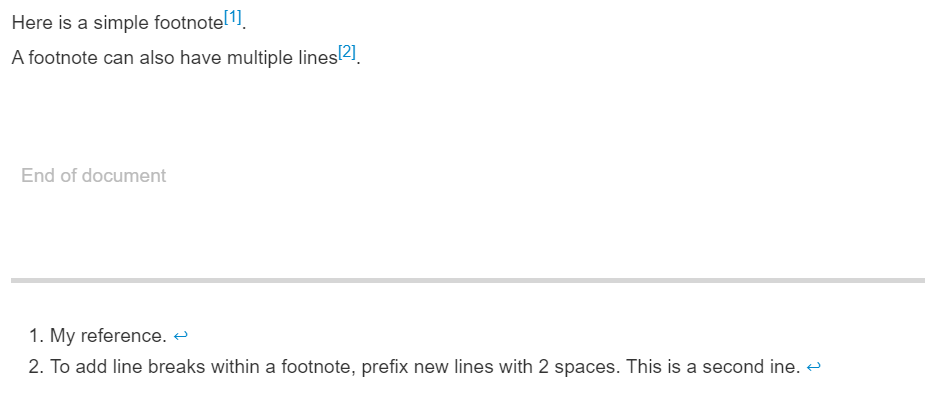

### 1.标题
要创建标题，请在标题文本前添加一至六个 # 符号。 你使用的 # 数量将决定层次结构级别和标题的大小。

示例:

```markdown
# 1 一级标题
## 1.1 二级标题
### 1.1.1 三级标题
#### 1.1.1.1 四级标题
##### 1.1.1.1.1 五级标题
###### 1.1.1.1.1.1 六级标题
```

效果:


---
### 2.文本样式

|样式|语法|示例|效果|
|:-:|:-:|:-:|:-:|
|加粗|** **或者__ __|\*\*加粗**| **加粗**|
|斜体|* *或者_ _|\*斜体*|*斜体*|
|删除线|\~~ \~~|\~\~删除线~~|~~删除线~~|
|粗体和嵌入的斜体|** _ _ **|\*\*粗体中嵌入 \_斜体_ 文字** | **粗体中嵌入 _斜体_ 文字**|
|全部加粗和斜体|\*\*\* \*\*\*|\*\*\*全部加粗和斜体***|***全部加粗和斜体***|
|下标|\<sub> \</sub>|文字\<sub>下标\</sub> |文字<sub>下标</sub>|
|上标|\<sup> \</sup>|文字\<sup>上标\</sup>|文字<sup>上标</sup>|

---
### 3.表格

使用管道符号（|）和破折号（-）来创建表格。
左对齐：在破折号的左侧加上一个冒号（:---）
右对齐：在破折号的右侧加上一个冒号（---:）
居中对齐：在破折号的两侧都加上冒号（:---:）

示例:

```markdown
| 表头1   | 表头2   | 表头3   |
| ------- | ------- | ------- |
| 单元格1 | 单元格2 | 单元格3 |
| 单元格4 | 单元格5 | 单元格6 |
| 单元格7 | 单元格8 | 单元格9 |
```

效果:

| 表头1   | 表头2   | 表头3   |
| ------- | ------- | ------- |
| 单元格1 | 单元格2 | 单元格3 |
| 单元格4 | 单元格5 | 单元格6 |
| 单元格7 | 单元格8 | 单元格9 |


---
### 4.折叠
若要使内容保持整洁，可以使用 `\<details>` 标记创建可展开的折叠部分。

示例:

```markdown
<details>
<summary>
标题1
</summary> 
这里填写折叠内容1<br>
这里填写折叠内容2
</details>
```

效果:

<details>
<summary>
标题1
</summary> 
这里填写折叠内容1<br>
这里填写折叠内容2
</details>


### 5.引用文字
要创建块引用，请在段落前添加一个 > 符号。

示例:

```markdown
> 文字示例1
> 文字示例2
```

效果:

> 文字示例1
> 文字示例2

---
### 6.引用代码

1. 使用单反引号可标注句子中的代码或命令。

    示例:

    Use \`git status\` to list all new or modified files that haven't yet been committed.

    效果：

    Use `git status` to list all new or modified files that haven't yet been committed.

2. 要将代码或文本格式化为各自的不同块，请使用三反引号。

    示例:

    \```python<br>
    print ("Hello, World")	
    \```

    效果:

    ```python
    print ("Hello, World")	
    ```

---
### 7.注释

使用类似以下的方式

```markdown
<!-- 注释内容 -->
```

---
### 8.链接

链接文本放在中括号内，链接地址放在后面的括号中，链接title可选。
超链接Markdown语法代码：\[超链接显示名](超链接地址 "超链接title")
使用尖括号可以很方便地把URL或者email地址变成可点击的链接。

示例:

```markdown
markdown的[链接](https://markdown.com.cn/)<br>
<https://markdown.com.cn/>
```


效果:

markdown的[链接](https://markdown.com.cn/)<br>
<https://markdown.com.cn/>

---
### 9.章节链接

使用\[链接文本](#anchor-name)创建章节链接

示例:

```markdown
参考章节[文本样式](#2 文本样式)
```

效果:

参考章节[文本样式](#2)

---
### 10.相对链接

使用\[链接文本](相对路径)创建文件相对链接

示例:

```markdown
参考文档[Alarm.md](./Alarm.md)
```

效果:

参考文档[Alarm.md](./Alarm.md)

---
### 11.图片

使用\![替代文字]\(图片URL)的语法来插入图片

示例:

```markdown
本地图片

网络图片
```

效果:

本地图片

网络图片

---
### 12.有序列表

要创建有序列表，请在每个列表项前添加数字并紧跟一个英文句点。数字不必按数学顺序排列，但是列表应当以数字 1 起始。

1. 第一章
2. 第二章
3. 第三章

### 13.无序列表
要创建无序列表，请在每个列表项前面添加破折号 (-)、星号 (*) 或加号 (+) 。缩进一个或多个列表项可创建嵌套列表。

示例:
```markdown
- 张三
- 张四
* 李三
* 李四
+ 王三
+ 王四
```

效果:

- 张三
- 张四
* 李三
* 李四
+ 王三
+ 王四

### 14.嵌套列表

要在保留列表连续性的同时在列表中添加另一种元素，请将该元素缩进四个空格或一个制表符

示例:

```markdown
1. 第一章
    - 第一节
        - 第一段
            - 第一行
```

效果:

1. 第一章
   - 第一节
      - 第一段
        - 第一行

---
### 15.任务列表

在列表项前加连字符和空格，后接 [ ]。 要将任务标记为完成，请使用 [x]。

示例:

```markdown
- [ ]  任务1
- [x]  任务2 已完成
- [ ]  任务3
```

效果:

- [ ]  任务1
- [x]  任务2 已完成
- [ ]  任务3


---
### 16.段落

通过在文本行之间留一个空白行，可创建新段落。

段落1

段落2

---
### 17.忽略markdown格式

通过在 Markdown 字符前面输入 \，可指示 GitHub 忽略 Markdown 格式（或对其进行转义）。

示例:

```markdown
Let's rename \*our-new-project\* to \*our-old-project\*.
```

效果:

Let's rename \*our-new-project\* to \*our-old-project\*.


---
### 18.脚注

在需要插入脚注的文本后面加上 \[^1]，其中的数字可以根据需要进行调整。
在文档的末尾或任意位置插入脚注内容，格式为 [数字]: 脚注内容。

示例:

```markdown
Here is a simple footnote[^1].
A footnote can also have multiple lines[^2].

[^1]: My reference.
[^2]: To add line breaks within a footnote, prefix new lines with 2 spaces.  This is a second ine.
```

效果:


